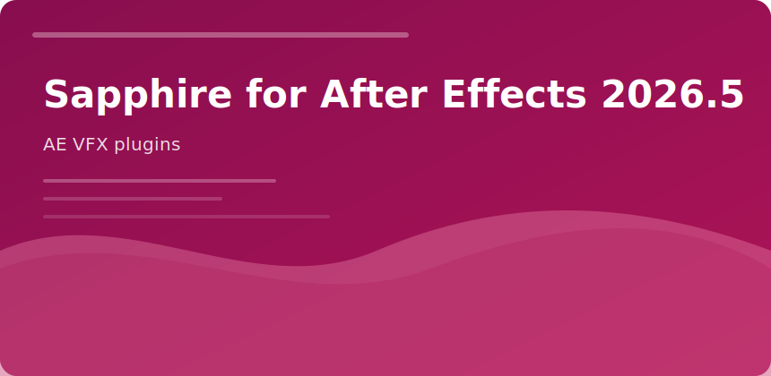

  

  

## Sapphire for After Effects 2026.5

Industry staple for **photoreal glows**, **lens flares**, and **broadcast transitions** inside After Effects.

### Categories

- Lighting (Glow, Glare, Aurora)
- Blur & sharpen
- Distortion
- Stylize (FilmDamage, Cartoon)
- Transitions (S_Wipe*, S_Dissolve*)

### 2026.5

Apple Silicon AE builds get faster GPU paths; new presets tagged `26.5`.

### Practice

Apply Sapphire on adjustment layers; cache precomps when stacking 4+ effects on 4K.

sapphire after effects 2026 boris fx vfx plugins transitions
